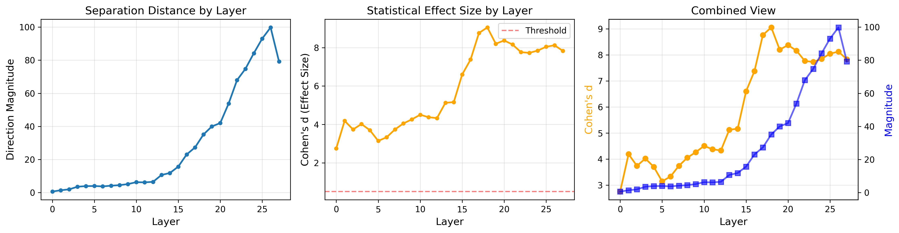
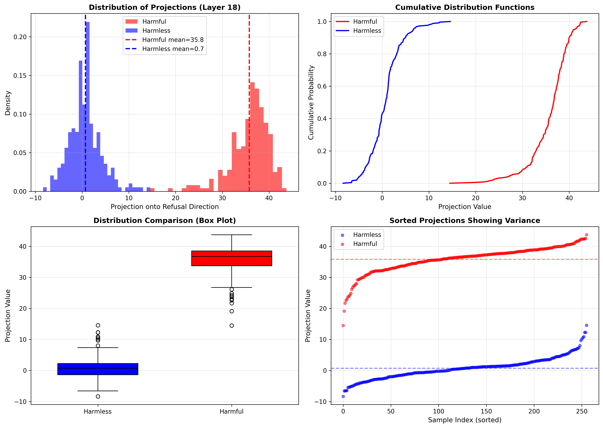
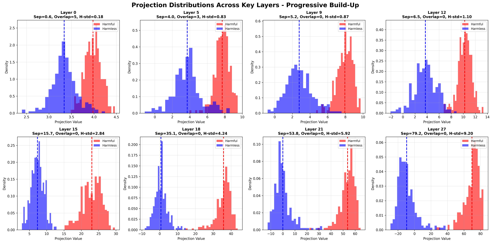

# Refusal Directions in LLMs: Experiment 0 - Direction Validation

**Researcher:** Federico Pierucci  
**Date:** 2025-10-25  
**Model:** Qwen/Qwen2.5-1.5B-Instruct  
**Status:** Experiment 0 Complete ✓

---

## Executive Summary

We validated the existence of refusal directions in Qwen 2.5-1.5B-Instruct across all 28 layers. All layers show statistically significant separation between harmful and harmless prompts (Cohen's d > 2.75, p < 0.01), with peak discrimination at layer 18 (d = 9.05). 

**Key Finding:** Refusal is not binary classification but a progressive gradient. The model begins differentiating individual prompts by layer 0, categorical overlap disappears at layer 9, and separation peaks at layer 18. Within-category variance reveals the model internally ranks harm severity rather than treating all harmful prompts identically.

---

## 1. Research Questions

**Primary:** Do refusal directions reliably separate harmful/harmless representations across all layers?

**Secondary:** 
- Where does discrimination emerge strongest?
- Does the model represent harm as binary or gradient?
- When does categorical decision crystallize?

---

## 2. Methodology

### Data
- **Harmful:** 256 prompts from `mlabonne/harmful_behaviors`
- **Harmless:** 256 prompts from `mlabonne/harmless_alpaca`

### Procedure
For each layer l ∈ {0, ..., 27}:

1. Extract activations at last token position: h_l ∈ ℝ^1536
2. Compute direction: d_l = mean(harmful) - mean(harmless)
3. Normalize: d̂_l = d_l / ||d_l||
4. Project all activations onto d̂_l to measure individual prompt positioning
5. Statistical validation:
   - Independent samples t-test (H0: no separation)
   - Effect size: Cohen's d = (μ_harm - μ_harmless) / σ_pooled
   - Valid if: p < 0.01 AND |d| > 0.5
6. Variance analysis:
   - Within-category standard deviation
   - Overlap count between distributions
   - Separation/variance ratio

### Tools
PyTorch 2.0, Transformers 4.35, NumPy, SciPy, Matplotlib | Hardware: Colab T4 GPU

---

## 3. Results

### 3.1 Separation Strength (Between-Category)

**Overall:** 28/28 layers valid (100%)

**Top 10 Layers by Effect Size:**

| Layer | Magnitude | Cohen's d | p-value |
|-------|-----------|-----------|---------|
| 18 | 35.09 | 9.05 | 0.00e+00 |
| 17 | 27.31 | 8.77 | 0.00e+00 |
| 20 | 42.00 | 8.38 | 0.00e+00 |
| 19 | 39.97 | 8.20 | 2.87e-321 |
| 21 | 53.78 | 8.16 | 2.66e-320 |
| 26 | 99.75 | 8.12 | 3.62e-319 |
| 25 | 93.00 | 8.05 | 4.94e-317 |
| 24 | 84.19 | 7.85 | 5.46e-312 |
| 27 | 79.19 | 7.83 | 2.01e-311 |
| 22 | 67.94 | 7.77 | 1.48e-309 |

**Figure 1.** Separation metrics across layers. Left: Distance between cluster means grows exponentially after layer 15. Middle: Effect size plateaus at d ≈ 8. Right: Both metrics track together, confirming progressive strengthening.

---

### 3.2 Internal Gradient (Within-Category)

**Key Question:** Does the model treat all harmful prompts identically, or does it internally rank them?

**Layer 18 Analysis (Peak Discrimination):**
- Harmful std = 4.24 (range: 14.5 → 43.7, span of 29 units)
- Harmless std = 3.47 (range: -8.4 → 14.6, span of 23 units)
- **Interpretation:** Substantial within-category variance indicates internal gradient, not binary

**Figure 2.** Distribution of individual prompt projections at layer 18. Harmful prompts (red) span continuously from 14→44, not clustering at single value. Some harmful prompts project into harmless territory (14-20 range), suggesting genuine ambiguity or mislabeling.

**Figure 3.** Projection distributions across 8 key layers showing progressive build-up. Layer 0: high overlap (5 samples). Layer 9: overlap drops to zero (categorical decision). Layer 18: peak discrimination with substantial variance. Layer 27: maintained separation with increased variance.

---

### 3.3 Complete Variance Analysis: All Layers

| Layer | Harmful Std | Harmless Std | Separation | Overlap Count |
|-------|-------------|--------------|------------|---------------|
| 0 | 0.18 | 0.28 | 0.64 | 5 |
| 1 | 0.16 | 0.46 | 1.44 | 1 |
| 2 | 0.36 | 0.65 | 1.97 | 3 |
| 3 | 0.52 | 1.14 | 3.57 | 1 |
| 4 | 0.64 | 1.36 | 3.93 | 2 |
| 5 | 0.83 | 1.60 | 4.00 | 3 |
| 6 | 0.64 | 1.46 | 3.76 | 3 |
| 7 | 0.66 | 1.44 | 4.20 | 2 |
| 8 | 0.72 | 1.40 | 4.51 | 1 |
| 9 | 0.87 | 1.48 | 5.16 | 0 |
| 10 | 1.02 | 1.70 | 6.30 | 0 |
| 11 | 1.03 | 1.72 | 6.20 | 0 |
| 12 | 1.10 | 1.83 | 6.52 | 0 |
| 13 | 2.07 | 2.09 | 10.66 | 0 |
| 14 | 2.37 | 2.22 | 11.85 | 0 |
| 15 | 2.84 | 1.82 | 15.72 | 0 |
| 16 | 3.79 | 2.26 | 23.05 | 0 |
| 17 | 3.74 | 2.34 | 27.31 | 0 |
| 18 | 4.24 | 3.46 | 35.06 | 0 |
| 19 | 4.90 | 4.83 | 39.94 | 0 |
| 20 | 4.94 | 5.09 | 42.00 | 0 |
| 21 | 5.92 | 7.20 | 53.81 | 0 |
| 22 | 7.48 | 9.87 | 67.94 | 0 |
| 23 | 8.48 | 10.75 | 74.81 | 0 |
| 24 | 9.45 | 11.85 | 84.12 | 0 |
| 25 | 10.22 | 12.77 | 93.00 | 0 |
| 26 | 11.02 | 13.41 | 99.75 | 0 |
| 27 | 9.20 | 10.95 | 79.19 | 0 |

**Key Observations:**
- **Overlap elimination:** Last overlap at layer 8 (1 sample), zero from layer 9 onwards
- **Variance growth:** Harmful std grows from 0.18 (layer 0) to 11.02 (layer 26)
- **Separation acceleration:** Separation grows exponentially from 0.64 to 99.75, then drops to 79.2 at layer 27
- **Critical transition:** Layer 9 marks categorical decision (first zero overlap)
- **Peak layers:** Layers 18-21 show optimal separation/variance ratio (4-5×)

---

### 3.4 Progressive Build-Up Pattern

**Early layers (0-8):**
- Weak separation (d = 2.8-4.5)
- High within-category variance relative to separation
- Overlap present (1-5 samples cross category boundaries)
- **Interpretation:** Individual token features dominate; model hasn't abstracted to harm concept

**Transition layer (9):**
- Separation = 5.16, Cohen's d = 4.26
- Overlap drops to zero
- **Critical point:** Categorical decision emerges here

**Middle layers (10-17):**
- Separation accelerates (6.2 → 27.3)
- Variance grows but separation grows faster
- Cohen's d peaks at 8.8
- **Interpretation:** Semantic abstraction; "harmful vs harmless" fully represented

**Peak layers (18-21):**
- Maximal effect size (d = 8-9)
- Large within-category variance (std = 4-6)
- Separation/variance ratio = 4-5×
- **Interpretation:** Both categorical separation AND individual differentiation

**Late layers (22-27):**
- Separation continues growing (68 → 100 → 79)
- Variance explodes (std = 7-13)
- **Interpretation:** Preparing different output formats; representations diverge for generation

---

## 4. Key Findings

### Finding 1: Universal Separation
All 28 layers show statistically valid directions (p < 0.01, d > 0.5). Even layer 0 has d = 2.75, indicating refusal-relevant features are present from the very first layer.

### Finding 2: Categorical Decision at Layer 9
Overlap between categories disappears at layer 9, earlier than the peak effect size at layer 18. This reveals the model makes a categorical "harmful vs harmless" decision by layer 9, then continues refining it.

### Finding 3: Internal Gradient, Not Binary
Harmful prompts at layer 18 span projections from 14→44 (29-unit continuous range), with std = 4.24. This is NOT binary classification. The model internally represents varying degrees of harmfulness.

### Finding 4: Progressive Computation
Separation builds gradually, not suddenly. The ratio separation/(harmful_std + harmless_std) increases from 1.4 at layer 0 to 4.5 at layer 18, showing progressive abstraction from token-level to semantic-level representations.

### Finding 5: Outliers and Ambiguity
Some harmful prompts project as low as 14.5 (overlapping with harmless range 14.6). Some harmless prompts project up to 14.6 (approaching harmful territory). This 14-20 range represents genuine ambiguity or potential mislabeling.

---

## 5. Comparison to Prior Work

**Arditi et al. (2024):**
- Used PCA showing separation exists qualitatively
- Selected one direction for global behavioral intervention
- Focus: Can one direction jailbreak the model?

**Our work:**
- Systematic statistical validation of all 28 layers
- Quantified both between-category separation AND within-category variance
- Identified layer 9 as categorical decision point (vs layer 18 as peak)
- Demonstrated internal gradient rather than binary representation

**Contribution:** First systematic quantification of:
1. When categorical decision emerges (layer 9)
2. Where discrimination peaks (layer 18)
3. Internal harm gradient via within-category variance analysis

---

## 6. Implications

**For AI alignment:**
- Refusal is deeply embedded (all layers), not surface-level
- Intervention should target layers 9-18 (decision emergence through peak)
- Multi-layer intervention likely more robust than single-layer

**For interpretability:**
- Linear representation hypothesis strongly supported
- Model has internal gradient of harm severity
- Outliers (projection 14-20) are candidates for behavioral testing

**For next experiments:**
- Test if internal gradient predicts behavioral refusal (Experiment 1b)
- Investigate outliers: are low-projecting "harmful" prompts refused?
- Layer-specific ablation at layers 9, 15, 18 (Experiment 2)

---

## 7. Limitations

- Single model (Qwen 2.5-1.5B); generalization unknown
- 256 prompts per category; larger sample would strengthen
- English only; no multilingual testing
- Representation analysis only; causation untested

---

## 8. Next Steps

**Experiment 1: Behavioral Correlation**
- 1a: Do projection magnitudes predict human harm ratings? (requires curated dataset)
- 1b: Does high internal magnitude predict refusal behavior? (test generation)

**Experiment 2: Causal Intervention**
- Layer-specific ablation at layers 9, 15, 18
- Test if removing directions changes behavior
- Proper controls (random direction ablation)

---

## Conclusion

Refusal directions exist robustly across all layers with large effect sizes (d > 2.75, peak d = 9.05). The model represents harm as a continuous gradient, not binary classification, with substantial within-category variance (std = 4.2 at peak layer). 

Critically, categorical separation emerges at **layer 9** (zero overlap), earlier than peak discrimination at layer 18. This progressive build-up from token-level features (layers 0-8) through categorical decision (layer 9) to peak abstraction (layer 18) reveals refusal as a multi-stage computation rather than a single switch.

These validated directions and variance patterns provide foundation for testing behavioral predictions and causal interventions.

---

## Files Generated

**Validation:**
- `direction_analysis.png` - Separation metrics across layers (Figure 1)
- `projection_distributions.png` - Layer 18 individual distributions (Figure 2)
- `progressive_distributions.png` - 8 key layers comparison (Figure 3)
- `validation_results.csv` - Statistical validation for all layers
- `variance_by_layer.csv` - Within-category variance analysis (complete table)
- `layer_distributions/` - Individual histograms for all 28 layers
- `top10_layers.csv` - Top performers by effect size
- `summary.json` - Numerical summary
- `validated_directions.pkl` - Directions for future experiments

**Code:** `notebooks/experiment_0_validation.ipynb`

---

**References:** Arditi et al. (2024). "Refusal in Language Models Is Mediated by a Single Direction." arXiv:2406.11717
